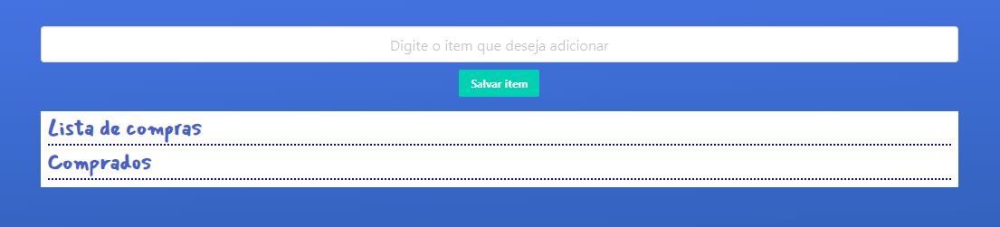
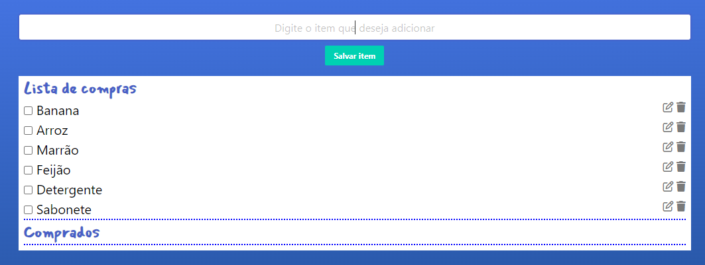

# Lista de Compras

Este é um simples aplicativo de lista de compras desenvolvido em HTML, CSS e JavaScript. Ele permite que o usuário adicione itens à lista, marque-os como comprados e edite os itens existentes.

  

#### Adicionando Lista de Itens

  

#### Funcionalidade de "riscar" o que já foi pego

  

## Funcionalidades

- Adição de itens à lista.
- Marcação de itens como comprados.
- Edição de itens existentes.
- Armazenamento persistente da lista usando localStorage.

## Estrutura do Projeto

- `styles.css`: Estilos para a página.
- `main.js`: Lógica principal do aplicativo.
- `index.html`: Página HTML que define a estrutura da interface do usuário.

## Como Usar

1. Abra o arquivo `index.html` em um navegador.
2. Digite o item desejado no campo de entrada.
3. Clique em "Salvar item" para adicionar à lista.
4. Marque os itens como comprados ou edite-os conforme necessário.

## Dependências

- [Bulma](https://bulma.io/): Framework CSS para criar interfaces responsivas.
- [Font Awesome](https://fontawesome.com/): Biblioteca de ícones para aprimorar a estética.
